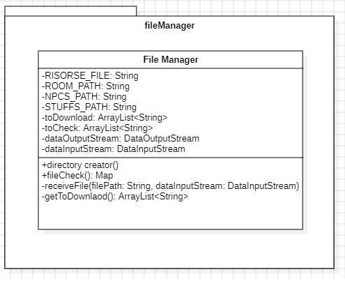
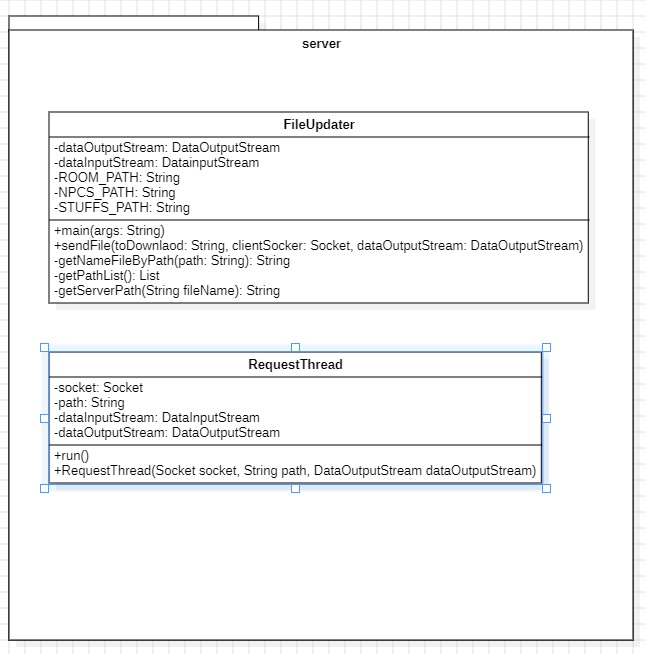
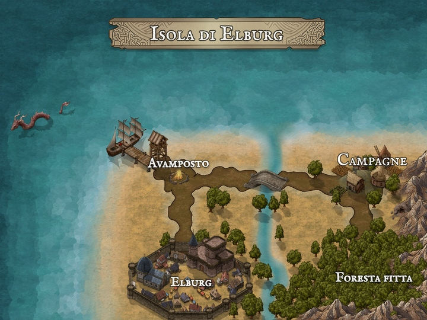

## Pirates adventures

## Gruppo: 
# Indice:
    Capitolo 1 - Descrizione tecnica:
        - Architettura del software
        - Diagramma delle classi
        - Specifica algebrica
        - Strutture implementate
    
    Capitolo 2 - Il gioco:
        - La storia
        - La mappa
        - Comandi disponibili
#

# Capitolo 1 - Descrizione Tecnica
## Architettura del Software
Il programma è completamente scritto in Java. Il software è gestito tramite pacchetti allo scopo di aumentarne la modularità, ne consegue maggiore riusabilità, inoltre assolve allo scopo di rendere il codice più comprensibile. In ogni pacchetto ci possono essere più pacchetti con i relativi metodi. Informazioni circa le stanza sono conservate all'interno di un database. È stato implementato un sistema client-server sui file del package gameObjectJson, questo ha lo scopo di poter implementare futuri aggiornamenti a questi file o in caso i file vengano erroneamente rimossi, riscaricarne l'ultima versione in dotazione al server in modo trasperente all'utente. 
 
# 

## Diagramma delle classi
Il diagramma in questione mostra il Server e il FileManager, dove quest'ultimo attraverso la rete è in grado di contattare il server e di ricevere, attraverso il server, i file che sono rilevati come assenti nella cartella *gameObjectJson*

#

## Specifica algebrica
Di seguito sono riportate le specifiche sintattiche e semantiche del dato astratto Lista.

    > Specifica Sintattica: 
    Tipi: Lista, Boolean, Posizione, Tipoelem, Int

    Operazioni:

        CreaLista () -> Lista
        InsLista (Lista, Posizione, Tipoelem) -> Lista
        CancLista (Lista, Posizione) -> Lista
        ListaVuota (Lista) -> Boolean
        ListaContElem (Lista, Tipoelem) -> Boolean
        DimLista (Lista) -> Int

    > Specifica Semantica:
    Data la lista List, la posizione p e l'elemento elem

        ListaVuota (CreaLista()) = true
        ListaVuota (InsLista (List, p, elem)) = false
        CancLista (InsLista (List, p, elem), p) = List
        ListaContElem (CreaLista(), elem) = false
        ListaContElem (InsLista (List, p, elem), elem) = true
        DimLista (InsLista (List, p, elem)) = DimLista (List) + 1
        DimLista (CreaLista()) = 0;

    Restrizioni:
        CancLista (CreaLista(), p) = error
#
## Strutture implementate

Il progetto si basa sui principi della programmazione ad oggetti e comprende diverse strutture chiave:

### Npcs
La classe `Npcs` gestisce le informazioni relative ai personaggi non giocanti nel gioco, inclusi i loro dialoghi e interazioni con il giocatore.

### Stuff
La classe `Stuff` gestisce gli oggetti all'interno dell'ambiente di gioco. Include dettagli come descrizioni, posizioni e proprietà degli oggetti.

### Room
La classe `Room` rappresenta le stanze all'interno del gioco. Contiene informazioni sulle caratteristiche specifiche della stanza.

### Parser
La classe `Parser` è responsabile dell'analisi dei comandi inseriti dall'utente e della loro interpretazione per l'esecuzione delle azioni corrispondenti nel gioco.

#
## Uso dei file
La principale tipologia di file utilizzata e il file Json nei quali si trovano informazioni circa il parsing, personaggi, stanze ed oggetti. Trovano utilizzo anche i file txt, per le stopword e per il testo della gui dell'help.

#
## GUI
L’interfaccia grafica è stata gestita mediante JavaSWING. Il gioco consente:

### mappa
mappa che mostra tutte le stanze in game per non perdersi
### lettore musicale
l'utilizzo di un player musicale per un sottofondo musicale 
### finestra di help
 è una finestra di help per comprendere al meglio i comandi messi a disposizione.
#

## Espressioni Lambda e classi anonime
### espressione lambda in Loader
nel metodo load list si è adoperata la seguente lambda expression :
> br.lines().flatMap(line -> Arrays.stream(line.split("\\s+")))
                    .forEach(wordsList::add);

questa lambda expression legge frasi da un BufferedReader, le divide in parole, e aggiunge queste parole ad una lista chiamata wordsList.
### classe anonima 
è stata utilizzata una classe anonima per avere una finestra di alert nel momento in cui si prova a chiudere la finestra del lettore musicale senza che prima si sia stoppata la musica. 

#

## Socket
Sono stati usati per la creazione del servizio di invio e ricezione dei file. In Particolare esistono due classi che si occupano di verificare se i file che si possiede sono esistenti, in caso di assenza contatta il server richiedendoli, quest'ultimo invia solo quelli chiesti.
Si specifica che in un piano reale, il server sarebbe stato esterno al progetto, ma lo abbiamo inserito all'interno per effettuare questa "simulazione".
#

## Thread
vi sono due utilizzi dei thread nel progetto:
### lettore musicale
thread implementati per avviare la riproduzione della musica di sottofondo che è possibile richiamare attraverso lo strumento telefono. 
### invio dei file
I thread, sono inoltre utlizzati per elegare il servizo di invio dei files del server, il quale cosi può rimanere in ascolto sulla sua porta.
#

## DataBase
Il database è stato utilizzato per per immagazzinare le descrizioni delle stanze, nonchè una descrizione iniziale e finale e poterle richedere tramite query quando necessario
#

# Capitolo 2 - The greedy pirate

## La storia
Questa avventura testuale si pone essere una via ludica per poter far allenare i bambini di età circa 5-7 anni a leggere, quindi la narrazione della storia sarà molto leggera e simpatica.
In particolare il protagonista è un pirata goloso che viene a conoscenza di una festa che si terrà sull'isola di Elburg in cui saranno presenti tanti dolciumi, una volta arrivato sull'isola gli viene vietato l'accesso al regno di Elburg in quanto in assenza di un arma per difendersi. Il giovane pirata girovagando per il regno incontrerà un fabbro che gli regalerà una spada, così che il protagonista possa tornare nel regno. Una volta arrivato nel regno dovrà usare la spada per battere il boss finale, ovvero una pignatta, alla quale sconfitta libererà tutti i dolciumi tanto cercati dal pirata goloso
## La mappa
### Gli ambienti del gioco sono di seguito riportati:

La mappa presenta 5 stanze, ovvero: l'avamposto, il ponte, le campagne, la foresta fitta e il regno di Elburg.
Nell'avamposto sarà possibile raccogliere l'oggetto mappa, appunto per visualizzare la mappa in questione, nelle campagne invece sarà possibile incontrare il fabbro per raccogliere la spada.

Sono state inserite due stanze non accessibili, la prima è appunto Elburg, la quale richiederà una spada per permettere l'accesso ad essa. L'altra è la foresta fitta, la quale invece rimarrà sempre inaccessibile per motivi di narrazione, potrebbe essere aperta magari in una futura versione dell'avventura testuale. 

#

## Obiettivo del gioco
Sconfiggere la pignatta per liberare i dolciumi al suo interno
#

## Comandi disponibili
I comandi riconosciuti dal gioco prevendono l'uso dei sinonimi dei seguenti verbi:      
+ osserva 
+ inventario
+ musica
+ help
+ parla
    + parla con [nomePersonaggio]
+ raccogli
    + Raccogli [nomeOggetto]
+ vai
    + vai a [direzione]
+ uccidi 
    + uccidi[nomePersonaggio]

## Link 

Link presentazione progetto --> https://www.canva.com/design/DAF64332GSE/YhFS6sUTe583VwbNfLXCfA/edit?utm_content=DAF64332GSE&utm_campaign=designshare&utm_medium=link2&utm_source=sharebutton

Link GitHub --> https://github.com/gas300/IlPirataGoloso

    

